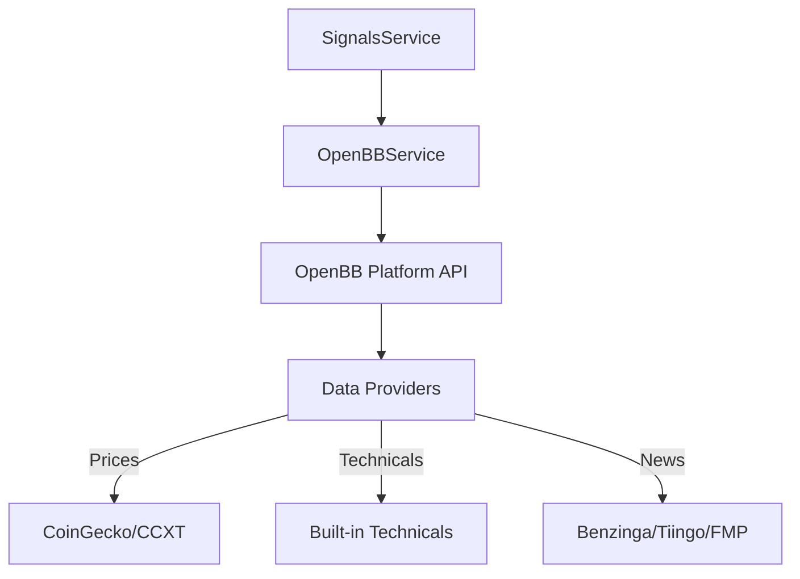

# OpenBB Integration Specification

This document outlines the technical requirements and implementation plan for integrating the OpenBB Platform into Lina's automated trading system (Phase 2).

## Architecture

Lina interacts with OpenBB via its **REST API interface**. This allows the TypeScript services to perform complex financial analysis without a local Python environment.



## Configuration

### API Connection
- **Default Base URL**: `http://localhost:6900`
- **Alternative (FastAPI)**: `http://localhost:8000`
- **Documentation/Swagger**: Access at `/docs` on the host port.

### Provider Setup
OpenBB manages its own API keys. Configuration is stored in `~/.openbb_platform/user_settings.json`.
Required providers for Lina:
- `coingecko` or `yfinance` (Price data)
- `benzinga` or `fmp` (News data)

## Key Endpoints

### 1. Historical Crypto Data
- **Endpoint**: `GET /crypto/price/historical`
- **Parameters**: `symbol`, `provider`, `interval`, `start_date`
- **Purpose**: Fetch OHLCV data for technical analysis.

### 2. Technical Indicators
- **Endpoint**: `POST /technical/rsi` | `POST /technical/macd`
- **Pattern**: Most technical endpoints accept a JSON body containing the OHLCV data fetched in step 1.
- **Payload**:
  ```json
  {
    "data": [...ohlcv_data],
    "target": "close",
    "period": 14
  }
  ```

### 3. News Aggregation
- **Endpoint**: `GET /api/news`
- **Parameters**: `symbol`, `limit`, `start_date`
- **Purpose**: Feed news headlines into the weighted signal aggregator.

## Implementation Plan (Phase 2)

### OpenBBService (`src/plugins/plugin-strategy-core/src/services/openbb.service.ts`)
- [ ] Implement `fetchOHLCV(symbol)`
- [ ] Implement `getTechnicals(data, type)`
- [ ] Implement `getNews(symbol)`
- [ ] Add health check to verify API availability

### SignalsService Enhancement
- [ ] Integrate `OpenBBService` to replace placeholders.
- [ ] Implement weighted scoring logic: `(Technical Score * 0.6) + (Sentiment Score * 0.4)`.
- [ ] Support asset-specific weighting (Majors vs. Memecoins).

## Development Setup

To run the local OpenBB API:
```bash
# Via Docker
docker run -it --rm -p 6900:6900 -v ~/.openbb_platform:/root/.openbb_platform openbb-platform:latest

# Via Python
pip install openbb
openbb-api --port 6900
```
